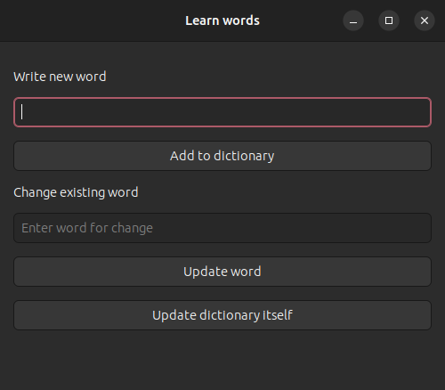

## Show notification on Gnome shell

### Usage

For first time run in this directory in terminal  
`sudo ./install.bash` for add path to this  
application in global scope, add desktop entry  
and add shell complition to.  

After that you can run "learnwords" in terminal.  
Or run from desktop menu.

### dictionary.json
```json
[
    {
        "summary": "thing",
        "body": "річ"
    },
    {
        "summary": "entirely",
        "body": "повністю"
    },
    {
        "summary": "afterwards",
        "body": "згодом"
    }
]
```

### words - csv format  

Column name: "summary body"

#### Example

```
thing річ
entirely повністю
afterwards згодом
homogeneous [ˌhōməˈjēnēəs] однорідний
```

|summary   |body    |
|----------|--------|
|thing     |річ     |
|entirely  |повністю|
|afterwards|згодом  |

### Commands  

`run` - run application in background.    
`update` - get "words" file content and add to  
"dictionary.json" file with transformation that  
needed.  
`open` - run gui  
`build` - build gui application
`add` - open `words` file in `vi` editor for manual write words
`check` - check if word exist in dictionary  

`./learn_words.bash &` - run application in  
background process. Application repeat each 5  
minutes.  
`kill %1` - terminate background process, when  
number 1 is a process number that return in  
terminal after running previus command.  

For write "words" file, is made possible use  
gui application.  
Run `./gui/gui.js`.  
  

For update one word from terminal use:  
`./updateWord.js enveriable "навколишнє середовище"`  

If you have 
[Simple Message](https://github.com/freddez/gnome-shell-simple-message) 
extension this application push to him text to show.  
Details in `extensionChangeText` function.  

### GUI

Base on GTK3, GJS and typesctipt  
For build local gui app, run command `npm run tsc`  

#### Require

- GJS
- Node.js
- typescript(tsc)
- jq

#### GUI Resources

- [Examples](https://github.com/cinatic/gjs-examples/blob/master/README.md)
- [GJS examples](https://gitlab.gnome.org/GNOME/gjs/tree/HEAD/examples)
- [gjs.guide/guides](https://gjs.guide/guides/)
- [gjs-docs.gnome.org/gtk30~3.0](https://gjs-docs.gnome.org/gtk30~3.0/)
- [gjs-docs.gnome.org/gio20~2.0/gio.file](https://gjs-docs.gnome.org/gio20~2.0/gio.file)
- [gtk4-gjs-book](https://rmnvgr.gitlab.io/gtk4-gjs-book/application/)
- [gi-typescript-definitions](https://gitlab.gnome.org/BrainBlasted/gi-typescript-definitions/-/tree/eb2a87a25c5e2fb580b605fbec0bd312fe34c492)
- [Typescript application](https://gitlab.gnome.org/World/vocalis)
- [gui/gtk2/gtkevents](https://zetcode.com/gui/gtk2/gtkevents/)
- [gdk/gdkkeysyms.h](https://gitlab.gnome.org/GNOME/gtk/-/blob/main/gdk/gdkkeysyms.h?ref_type=heads)
